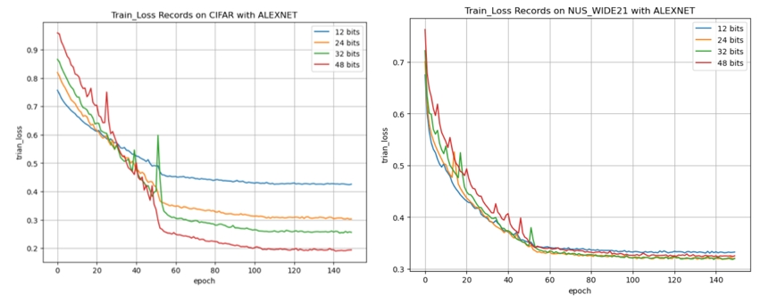
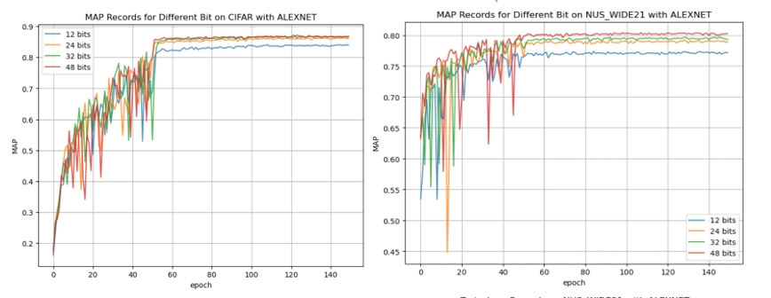
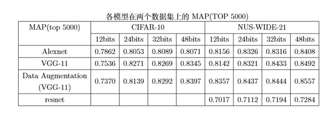
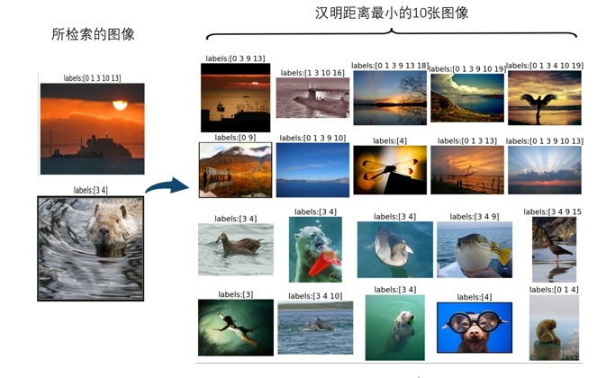

# DPSH算法的python实现

# 实验环境
实验平台是由课程提供的服务器，在一张RTX 3090型号的GPU上实现
```
python==3.10.8  torchvision==0.18  pytorch==2.3.1 cuda==12.1  
```

# 数据集
数据集CIFAR-10和NUS-WIDE-21的划分放在/data下
- CIFAR-10:由于原论文为matlab实现，先后运行DataPrepare.m以及SaveFig.m来处理CIFAR-10数据集的matlab版本。脚本实现如下划分：对于每个类，随机选择 1,000 张图像作为查询集，其余图像作为检索数据库。然后从检索数据库中抽取每类 500 张图像（共 5,000 张）作为未标记的训练集。
- NUS-WIDE-21:数据集的划分来自 DeepHash 库提供的样例，具体划分如下：每个类选取 100 个样本作为查询集，剩下样本作为数据库，每个类别选取 500 张图像作为训练集。在/data/NUS-WIDE中直接存放了相应数据集的索引以及one-hot编码。

# 如何运行
已经编写好如下两个demo文件，直接运行就可以分别对[12,24,32,48]四个不同长度的编码进行训练，训练结果以pkl文件存放在/log中。
```
python DPSH_CIFAR_10.py
python DPSH_NUS_WIDE_21.py
```
# 以Alexnet模型的训练过程可视化



# 各个模型的最终MAP结果（TOP 5000）


# 测试样本的检索示例(TOP 10)


# 论文以及原matlab实现
DPSH(IJCAI2016)  
paper [Feature Learning based Deep Supervised Hashing with Pairwise Labels](https://cs.nju.edu.cn/lwj/paper/IJCAI16_DPSH.pdf)   
code [DPSH-pytorch](https://cs.nju.edu.cn/_upload/tpl/00/ce/206/template206/code/DPSH.zip)


